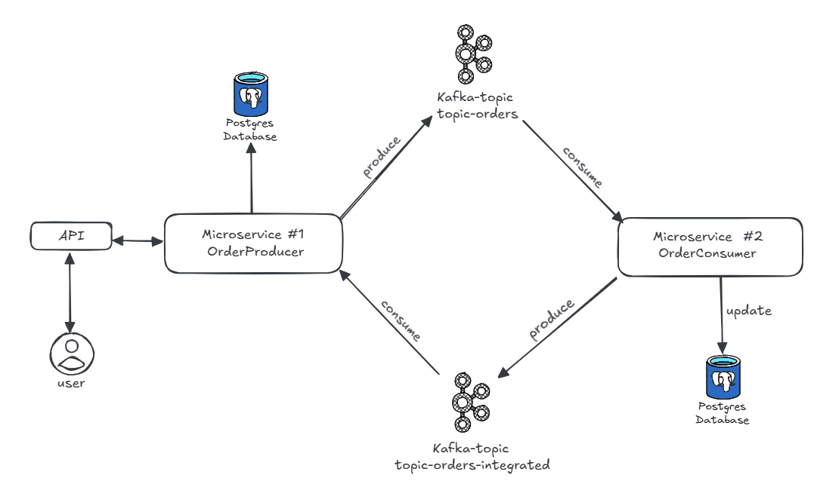

# Microservice - Java SpringBoot & Kafka
Este repositório contém 2 microserviços seguindo uma arquitetura Events-driven(EDA), para um restaurante que recebe pedidos online. São dois projetos Java e Spring Boot fazendo integração com o Kafka e persistindo dados no PostgreSQL. 

## Arquitetura do projeto

## Tecnologias utilizadas
- Java
- Spring boot
- Kafka
- PostgreSQL
- MapStruct
- Docker & Docker-Compose

## Contato

- [João Vitor Soares](https://www.linkedin.com/in/jo%C3%A3o-vitor-farias-soares-216870238/)

